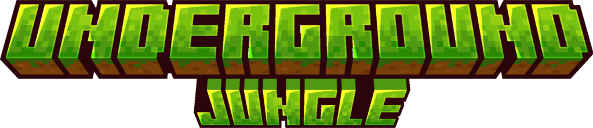

Underground Jungle is a mod that adds an underground jungle biome and an underground jungle temple.

## About

Underground Jungle adds an underground jungle biome and an underground jungle temple inspired by the one in Terraria
that contains new blocks, two new mobs and a new set of tools that can be found inside the temple.

The underground jungle biomes tends to generate below hot and humid biomes such as jungles, but might generate under
other biomes as well. The biome consists in patches of mud and jungle grass, a lush green grass that can spread to mud
blocks and keeps the same green color in all biomes.

The temple is a rare structure full of traps found in the underground jungle. Every temple has a treasure chest and a
temple key that you need to open the treasure chest. The treasure chest will contain one tool from the temple set.
These tools can mine every block in the vanilla game, they are faster than any vanilla tool, and they cannot be
destroyed by explosions, but they have a lower durability.

Jungle zombies can spawn in the underground jungle biome and mossy skeletons can spawn inside the temple. Both these
mobs can inflict the poison effect to players if they are hit.

### Main mod page

Curseforge: https://www.curseforge.com/minecraft/mc-mods/underground-jungle

Modrinth: https://modrinth.com/mod/underground-jungle

### Additional information

Versions past 19.x require the [Phantom Library](https://githuh.com/PhantomLoader/PhantomLoader)

The Fabric version of this mod requires the [Fabric API](https://github.com/FabricMC)

## Credits

Mod Author: [HexagonNico](https://github.com/HexagonNico)

Chiseled Temple Bricks texture by [Matriax](https://opengameart.org/content/inca-tileset)

### Check out my other mods

* [Spider Caves](https://github.com/HexagonNico/SpiderCaves): Adds a spider cave biome and a spider armor

## License

This mod is licensed under Creative Commons Attribution-NonCommercial-NoDerivatives 4.0 International.

You are free to share, copy and redistribute this mod in any medium or format, including modpacks, adventure maps, and
other creations made within Minecraft, as long as you respect the following conditions.

* You must give appropriate credit.
* You may not use the mod for commercial purposes.
* If you create a modified version of this mod, you may not redistribute the modified version.

You are free to use this mod in any modpack, as long as you do not sell it via any means.
You cannot re-upload this mod on other mod distribution platforms.
